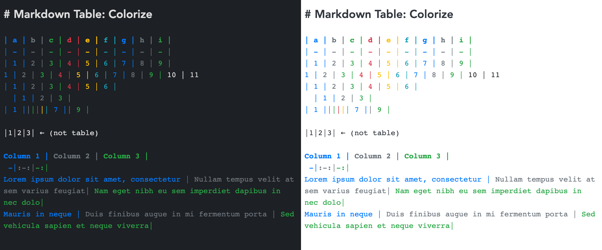

# Markdown Table: Colorize

This plugin add colors to joplin markdown table syntax so you can quickly identify what column the content belongs to. 

You can change the colors by adding your own CSS to joplin `userchrome.css` file.
Check [src/tabcolor.css](src/tabcolor.css) for the custom CSS classes used by this plugin.

## Themes

I prepared some simple CSS customization in case you don't like the default color schemes. Just open corresponding file and copy the content to your `userchrome.css` file.

### No background color
[themes/nobackground.css](themes/nobackground.css)

